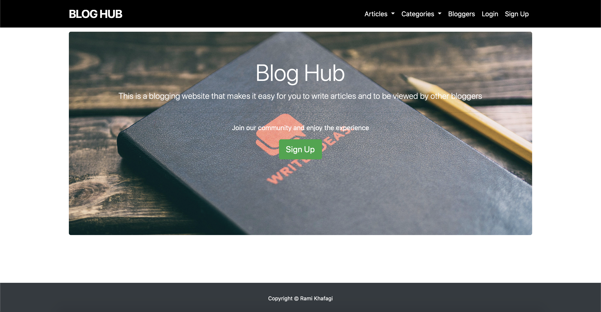

# Blog Hub
This is a blogging web application for users to share their thoughts and ideas with other people. <br/>
 

## Table Of Contents
* [General Info](#general-info)
* [Technologies](#technologies)
* [Setup](#setup)
* [Features](#features)
* [Examples](#examples)
* [Contact](#contact)
## General Info
I developed this project to learn ruby and ruby on rails and work with ORM(Object-Relation-Mapping) using rails ActiveRecord.

## Technologies
* Ruby v2.7.1
* Rails v6.0.3
* SQLite v1.4.0
* Bootstrap4 v4.5.2

# Setup
To clone and run this application, you'll need [Ruby](https://www.ruby-lang.org/en/) and [Rails](https://rubyonrails.org) on your computer. <br/>
From your terminal:

```bash
# Clone this repository
$ git clone https://github.com/ramikhafagi96/blog-app.git

# Go into the repository directory
$ cd blog-app

# Install gems needed
$ bundle install

# Run the app
$ rails server
```

## Features
* Register user using username, email and password
* Login user using username and password and maintain user session
* Add an article with title and body
* View article in a paginated view
* Edit and delete an article
* Users can view other people's users and read them
* An admin user can delete a user's account or a user's article
 
 ## Examples
 
 

## Contact
Email: rami.developer96@gmail.com <br/>
Linkedin: <a href="https://linkedin/in/ramikhafagi96">ramikhafagi96</a>
